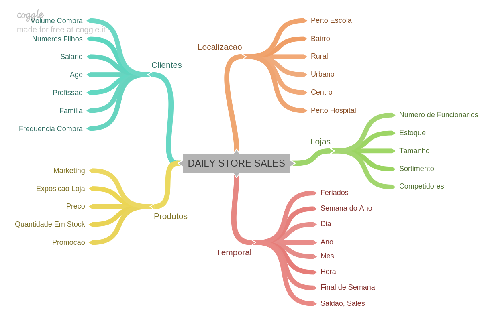

# Rossmann Sales Prediction

Neste repositório estará contido o processo de um projeto de machine learning para previsão de vendas de uma rede de farmácias

## 1.0 Business problem

### 1.1 About Rossmann
A Rossmann é uma das maiores redes de farmácias na Europa, com cerca de 56.200 funcionários e mais de 4.000 lojas. A empresa foi fundada em 1972 por Dirk Rossmann, com sede em Burgwedel, perto de Hanôver, na Alemanha.

### 1.2 The problem
O CFO da Rossmann decidiu fazer fazer reformas em algumas lojas, porém para determinar quais lojas seriam reformadas, ele nos solicitou a previsão de vendas em todas as lojas nos próximos 6 meses.

### 1.3 The data
| Atributo | Descrição |
| :----- | :----- |
| ID | Gerado a partir do Store + Date |
| Store | Id único para cada loja |
| Sales | O volume de vendas realizadas neste dia |
| Customers | O número total de clientes na loja neste dia |
| Open | Indicador para saber se a loja estava aberta: 0 = fechada, 1 = aberta |
| State Holiday | Indica feriado estadual. a = feriado, b = feriado da Páscoa, c = Natal, 0 = Nenhum |
| School Holiday | Indica fechamento das escolas públicas |
| Store Type | Descreve um entre os 4 modelos de lojas diferentes: a, b, c, d |
| Assortment | Descreve um nível de sortimento: a = básico, b = extra, c = estendido |
| Competition Distance | Distância em metros até a loja concorrente mais próxima |
| Competition Open Since [Month/Year] | Fornece o ano e o mês aproximados em que o concorrente mais próximo foi aberto |
| Promo | Indica se uma loja está fazendo uma promoção naquele dia |
| Promo2 | A Promo2 é uma promoção contínua e consecutiva para algumas lojas: 0 = a loja não está participando, 1 = a loja está participando |
|Promo2 Since [Year/Week] | Descreve o ano e a semana do calendário em que a loja começou a participar da Promo2 |
| Promo Interval | Descreve os intervalos consecutivos em que a Promo2 é iniciada, nomeando os meses em que a promoção é iniciada novamente. Por exemplo, "fevereiro, maio, agosto, novembro" significa que cada rodada começa em fevereiro, maio, agosto, novembro de qualquer ano para essa loja |

## 2.0 Business assumptions
* Na coluna CompetitionDistance os valores NA foram alterados para 200.000 metros, significando que não a competidor em um raio menor que 200.000 metros.
* Para valores NA em Competition Open Since[Month/Year], utilizamos os mesmos dados da coluna Date.
* No caso da coluna Promo2Since[Year/Week], os valores NA também foram substituídos pelo valor da coluna Date.

## 3.0 Solution strategy
CRISP-DM é a abreviação de Cross Industry Standard Process for Data Mining, que pode ser traduzido como Processo Padrão Inter-Indústrias para Mineração de Dados. É um modelo de processo de mineração de dados que descreve abordagens comumente usadas por especialistas em mineração de dados para atacar problemas.

Como base para este projeto usaremos  o CRISP, uma vez realizado todo o primeiro ciclo do CRISP, nós podemos fazer outras interações, criar novas features, gerar novos insights, melhorar a performance do modelo, tudo com objetivo de entregar mais valor para a empresa. Também é importante durante todo o processo, conversar com os interessados no projeto, a fim de mantê-los informados, e setar as expectativas.

Todos os códigos e visualizações deste projeto podem ser seguidos neste [notebook](notebooks\rossmann_sales_prediction.ipynb).

### 3.1 Data description
* As colunas foram renomeadas com uma função que transforma para snakecase e remove espaços
* Visualização do tamanho do conjunto de dados(total de linhas e colunas)
* Verificação dos tipos de cada colunas e alteração conforme necessário
* Checando os valores NA e preenchendo possíveis dados faltantes
* Estatística descritiva com os dados numéricos
* Análise dos dados categóricos

### 3.2 Feature engineering
* Um mapa mental foi desenvolvido para ajudar na geração de hipóteses, colocando o objetivo no centro e os atributos nas ramificações. O propósito é compreender como esses atributos podem influenciar as vendas.

**Mind Map of Hypotheses**

* Através do mapa mental, elaboramos uma lista de hipóteses com o intuito de avaliar o impacto de cada uma nas vendas.
* Foram desenvolvidas novas features com a finalidade de facilitar a visualização de tendências temporais e também para auxiliar o modelo.

### 3.3 Feature filtering
* Os dias em que as lojas estavam fechadas e aqueles sem registros de vendas foram removidos
* Colunas que foram derivadas em outras variáveis durante o processo de feature engineering foram removidas
* A coluna de customers foi removida, uma vez que não dispomos dos dados sobre a quantidade de clientes que visitarão a loja nas próximas 6 semanas. Em um próximo ciclo do processo CRISP, seria interessante realizar uma previsão da quantidade de clientes que frequentarão a loja nas próximas semanas, para, em seguida, efetuar uma previsão de vendas.

### 3.4 EDA - Exploratory Data Analysis
Nesta etapa iremos analisar os dados em três etapas, sendo a primeira análise somente da variável a qual queremos encontrar, sendo essa a *sales*, nas demais etapas iremos analisar as hipóteses para entender as relações entre as demais variáveis e a variável resposta, e na ultima etapa iremos analisar as relações de todas as variáveis entre si.

**Univariate analysis**
* Ao observar o gráfico da variável resposta, identificamos que a distruibuição necessitava de um aprimoramento (skew positiva), desta forma aplicamos uma função logarítmica de forma a transformar o gráfico em uma distribuição normal, sendo assim melhorando o desempenho do modelo de machine learning

**Bivariate analysis**
* A validação das hipóteses foi realizada por meio da visualização de dados, com o propósito de compreender a relação entre as variáveis e a variável resposta, visando extrair insights.

**Multivariate analysis**
* Plot de correlação das variáveis numéricas (Pearson)
* Plot de correlação das variáveis categórias (Cramer's V)

### 3.5 Data preparation
* Identificamos as variáveis com as maiores variâncias (desvio padrão)
* Dentre as variáveis selecionadas, as que possuem mais outliers utilizamos o RobustScaler e as que possuem menos utilizamos o MinMaxScaler
* Aplicamos encoding nas variáveis categóricas, utlizando OneHotEncoder, LabelEncoder e OrdinalEncoder
* Transformamos as variáveis temporais para um modelo cíclico
* Para a variável resposta fizemos uma transformação de log, de forma a obter uma distruibuição normal

### 3.6 Feature selection
* De forma a identificar as vendas das próximas 6 semanas, separamos o dataset reservando as ultimas semanas para validação posteriormente
* Utilizando o algoritimo SelectKBest para identificar as melhores features para o modelo

### 3.7 Machine Learning Modelling
* Seguindo a metodologia do CRISP, neste primeiro ciclo utilizaremos 4 modelos e avaliaremos as suas métricas para definir qual o melhor modelo será utilizzado nos próximos passos

1. Average Model: Modelo de média. Ele será usado para avaliar a performance dos demais modelos.
2. Linear Regression Model: A regressão linear modela a relação entre variáveis ajustando uma equação linear aos dados observados.
3. Random Forest Regression Model: Algoritmo que cria uma combinação (ensemble) de árvores de decisão.
4. XGBoost Regression model: Algoritmo de aprendizado de máquina, baseado em árvore de decisão e que utiliza uma estrutura de Gradient boosting.

Temos então as seguintes métricas para os modelos testados:  

Podemos observar que o modelo linear performou pior que o modelo da média, desta forma podemos presumir que temos um problema com dados complexos

Avaliamos também os modelos pela técnica de Cross Validation com o objetivo de identificar um possível overfitting nos modelos. Nesta técnica fazemos algumas iterações em que  
selecionamos uma parte do dataset e dividimos em dois conjuntos de treino e teste, de forma que o conjunto de teste esteja sempre à frente em relação ao tempo do conjunto de treino.  
Por fim iteramos por todo o dataset, obtendo assim uma métrica que seja coerente ao decorrer do tempo.  

* Observamos que o modelo RandomForest teve uma performance semelhante ao XGBoost, sendo assim escolhemos o XGBoost como o modelo que será utilizado no decorrer do projeto pois o mesmo possui  
menor capacidade computacional, de forma assim a otimizar o projeto

### 3.8 Hyperparameter Fine Tunning
* Com o modelo escolhido, fizemos então a tunagem dos hiperparâmetros utilizando a técnica de RandomSearch aliada com CrossValidation. Para tal selecionamos um intervalo de valores para cada hiperparâmetro, iteramos em um método de forma a identificar em qual iteração obteve a melhor performance.

* Com hiperparâmetros tunados tivemos a seguinte performance:  

### 3.9 Performance valuation
* Por tratar-se de um problema de regressão, iremos avaliar o erro do modelo em relação aos valores de teste, para tal fizemos 4 gráficos que estão representados abaixo, sendo eles:
    1. Resultado das predições de vendas em relação aos valores reais ao longo de 6 semanas
    2. Taxa do erro em relação ao tempo (o quanto o modelo erra por semana)
    3. Distribuição do erro (verifica se o modelo erra mais ou não em quantidade)
    4. Previsão em relação ao erro (verifica se o modelo erra mais ou menos por prever um valor de venda maior)

### 3.10 Model deployment
* Com o objetivo de atender a necessidade dos líderes da Rossmann de acessar as previsões a qualquer momento, fizemos um bot no aplicativo Telegram. Desta forma qualquer membro da empresa que necessite tomar decisões sobre a empresa pode acessar este bot através de uma troca de mensagens no Telegram, sendo acessível em qualquer hora e lugar desde que tenha uma conexão de internet.

* O bot foi desenvolvido utilizando o Flask e o server do Render, abaixo está esquematizado a arquitetura da aplicação  

* Um exemplo de funcionamento do bot  

## 4.0 Conclusions
* Entrega rápida de valor para o cliente pela utilização do Método CRISP-DM
* Com a EDA podemos validar algumas hipóteses importante:
    - As lojas com maior sortimento de produtos vendem mais
    - As lojas vendem mais no segundo semestre do ano
    - As lojas com promoções consecutivas/extendidas vendem menos

## 5.0 Next steps
Seguindo o método do CRISP, em um próximo ciclo podemos:
* Avaliar novas hipóteses
* Prever a quantidade de clientes que irão visitar a loja por dia
* Melhorias no bot do Telegram, com novos gráficos e demais informações
     

## 6.0 Tools

